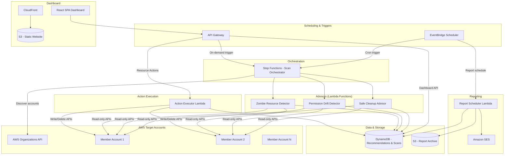
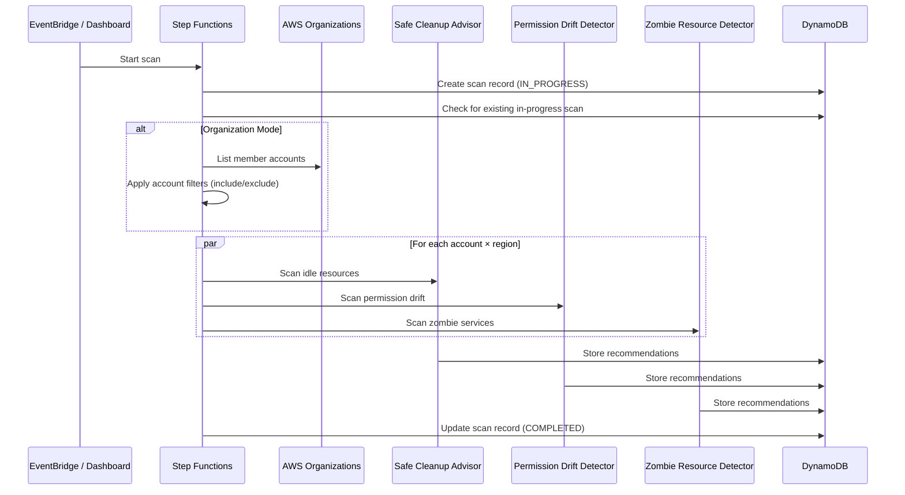

# Design Document: AWS Account Governance Engine

## Overview

The AWS Account Governance Engine is a serverless platform deployed on AWS that continuously scans one or more AWS accounts to detect idle resources, permission drift, and zombie services. It produces actionable recommendations surfaced through a web dashboard and scheduled email reports. Users can also initiate resource cleanup actions directly from the dashboard.

The system operates in two modes:
- **Single-account mode**: Scans a single AWS account using locally configured IAM permissions.
- **Organization mode**: Discovers member accounts via AWS Organizations API and assumes cross-account IAM roles to scan each account.

All scanning is read-only. Write/delete operations only occur when a user explicitly triggers a Resource Action from the dashboard.

### Key Design Decisions

1. **Serverless-first**: All compute runs on AWS Lambda to minimize operational overhead and cost. Step Functions orchestrate multi-step scan workflows.
2. **TypeScript throughout**: Both backend (Lambda) and frontend (React) use TypeScript for type safety and shared model definitions.
3. **DynamoDB for findings storage**: Recommendations and scan metadata are stored in DynamoDB for fast lookups and flexible querying with GSIs.
4. **SES for email delivery**: Amazon SES handles scheduled report emails with built-in retry and delivery tracking.
5. **CDK for infrastructure**: AWS CDK (TypeScript) defines all infrastructure as code, enabling reproducible deployments.
6. **API Gateway + Lambda for dashboard API**: REST API fronted by API Gateway with Lambda handlers serves the dashboard.
7. **S3 + CloudFront for dashboard hosting**: Static React SPA hosted on S3 with CloudFront distribution.

## Architecture

### High-Level Architecture Diagram



### Scan Orchestration Flow




## Components and Interfaces

### 1. Scan Orchestrator (Step Functions State Machine)

Coordinates the end-to-end scan workflow. Handles account discovery, region iteration, parallel advisor execution, and scan status tracking.

**Inputs:**
- `scanMode`: `"single-account"` | `"organization"`
- `regions`: `string[]` (optional, defaults to all commercial regions)
- `accountFilter`: `AccountFilter` (optional, organization mode only)
- `lookbackPeriods`: `LookbackConfig`

**Outputs:**
- `scanId`: `string`
- `status`: `"COMPLETED"` | `"FAILED"`
- `summary`: `ScanSummary`

**Key Behaviors:**
- Checks for in-progress scans before starting; rejects if one exists.
- In organization mode, discovers accounts via Organizations API, applies include/exclude filters.
- Fans out advisor Lambdas in parallel per account per region.
- Records scan start/end time and resource count.

### 2. Safe Cleanup Advisor (Lambda)

Scans for idle resources using read-only AWS APIs and CloudWatch metrics.

**Interface:**
```typescript
interface SafeCleanupAdvisorInput {
  accountId: string;
  region: string;
  lookbackDays: number;
  crossAccountRoleArn?: string;
}

interface SafeCleanupAdvisorOutput {
  recommendations: Recommendation[];
  resourcesEvaluated: number;
  errors: ScanError[];
}
```

**Resource Detection Logic:**
| Resource Type | Detection Criteria | AWS APIs Used |
|---|---|---|
| EBS Volumes | Unattached + zero read/write ops in lookback | EC2.describeVolumes, CloudWatch.getMetricStatistics |
| EC2 Instances | Stopped state > lookback period | EC2.describeInstances |
| Elastic IPs | Not associated with running instance | EC2.describeAddresses, EC2.describeInstances |
| Load Balancers | Zero healthy targets > lookback period | ELBv2.describeTargetHealth, CloudWatch.getMetricStatistics |
| Security Groups | Not attached to any network interface | EC2.describeSecurityGroups, EC2.describeNetworkInterfaces |

**Dependency Checking:**
- For each idle resource, queries related resources (e.g., snapshots referencing an EBS volume, launch templates referencing a security group).
- If dependencies found: Risk_Level = High, includes dependency list.
- If no dependencies: Risk_Level = Low.

### 3. Permission Drift Detector (Lambda)

Analyzes IAM entities against CloudTrail usage data.

**Interface:**
```typescript
interface PermissionDriftDetectorInput {
  accountId: string;
  region: string;
  lookbackDays: number;
  crossAccountRoleArn?: string;
}

interface PermissionDriftDetectorOutput {
  recommendations: Recommendation[];
  resourcesEvaluated: number;
  errors: ScanError[];
}
```

**Detection Logic:**
- Lists all IAM users and roles with their attached/inline policies.
- Queries CloudTrail for API calls made by each entity within the lookback period.
- Compares granted permissions against exercised permissions.
- Flags entities with unused admin access as High risk.
- Flags users with no login + no API activity as deactivation candidates.
- Logs and skips unparseable policies.

### 4. Zombie Resource Detector (Lambda)

Identifies running services with no meaningful activity.

**Interface:**
```typescript
interface ZombieResourceDetectorInput {
  accountId: string;
  region: string;
  lookbackDays: number;
  crossAccountRoleArn?: string;
}

interface ZombieResourceDetectorOutput {
  recommendations: Recommendation[];
  resourcesEvaluated: number;
  errors: ScanError[];
}
```

**Resource Detection Logic:**
| Resource Type | Detection Criteria | AWS APIs Used |
|---|---|---|
| Lambda Functions | Zero invocations in lookback | Lambda.listFunctions, CloudWatch.getMetricStatistics |
| RDS Instances | Zero connections in lookback | RDS.describeDBInstances, CloudWatch.getMetricStatistics |
| ECS Services | Zero running tasks > lookback | ECS.describeServices |
| NAT Gateways | Zero bytes processed in lookback | EC2.describeNatGateways, CloudWatch.getMetricStatistics |
| CloudWatch Log Groups | No new events in lookback | CloudWatchLogs.describeLogGroups, CloudWatchLogs.filterLogEvents |

**Cost Estimation:**
- Uses AWS Pricing API or hardcoded regional pricing tables to estimate monthly cost per zombie resource.

### 5. Action Executor (Lambda)

Executes user-initiated Resource Actions against target AWS accounts.

**Interface:**
```typescript
interface ActionExecutorInput {
  actionId: string;
  userId: string;
  recommendationId: string;
  accountId: string;
  region: string;
  resourceId: string;
  resourceType: ResourceType;
  actionType: ActionType;
  crossAccountRoleArn?: string;
}

interface ActionExecutorOutput {
  actionId: string;
  status: "SUCCESS" | "FAILED";
  error?: string;
  timestamp: string;
}
```

**Supported Actions:**
| Resource Type | Supported Actions | AWS API |
|---|---|---|
| EC2 Instance | terminate, stop | EC2.terminateInstances, EC2.stopInstances |
| EBS Volume | delete | EC2.deleteVolume |
| Elastic IP | release | EC2.releaseAddress |
| Lambda Function | delete | Lambda.deleteFunction |
| RDS Instance | stop, delete | RDS.stopDBInstance, RDS.deleteDBInstance |
| ECS Service | stop | ECS.updateService (desiredCount=0) |
| Security Group | delete | EC2.deleteSecurityGroup |
| NAT Gateway | delete | EC2.deleteNatGateway |

**Security:**
- Uses a separate IAM role with write/delete permissions, distinct from the read-only scanning role.
- Logs every action with user identity, resource, action type, timestamp, and result.

### 6. Dashboard API (API Gateway + Lambda)

REST API serving the React dashboard.

**Endpoints:**
| Method | Path | Description |
|---|---|---|
| GET | /scans | List scan history |
| GET | /scans/{scanId} | Get scan details |
| POST | /scans | Trigger on-demand scan |
| GET | /recommendations | List recommendations (with filters) |
| GET | /recommendations/{id} | Get recommendation detail |
| POST | /actions | Initiate a resource action |
| GET | /actions | List action history |
| GET | /summary | Get dashboard summary (counts, costs) |
| GET | /trends | Get recommendation trends (last 10 scans) |
| GET | /config | Get current configuration |
| PUT | /config | Update configuration |

**Query Parameters for /recommendations:**
- `advisorType`: Filter by advisor
- `riskLevel`: Filter by risk level
- `region`: Filter by AWS region
- `resourceType`: Filter by resource type
- `accountId`: Filter by account (organization mode)
- `scanId`: Filter by scan

### 7. Report Scheduler (Lambda)

Generates and sends email reports via SES.

**Interface:**
```typescript
interface ReportSchedulerInput {
  frequency: "daily" | "weekly" | "monthly";
  recipients: string[];
  scanMode: ScanMode;
}
```

**Report Content:**
- Total recommendations by advisor type and risk level.
- Top 10 recommendations by estimated cost savings.
- Top 5 highest-risk permission drift findings.
- Total estimated monthly cost savings.
- In organization mode: per-account breakdown and top 5 accounts by savings.

**Delivery:**
- Sends via SES with HTML-formatted email body.
- Retries up to 3 times with exponential backoff on failure.
- Archives report to S3 for audit trail.

### 8. Dashboard (React SPA)

Single-page application hosted on S3/CloudFront.

**Views:**
- **Summary View**: Recommendation counts by advisor and risk level, total cost savings, last scan timestamp.
- **Recommendations List**: Filterable/sortable table of all recommendations.
- **Recommendation Detail**: Full details, dependency list, cost savings, available Resource Actions.
- **Trend View**: Line chart of recommendation counts over last 10 scans.
- **Action History**: Table of all past Resource Actions with status.
- **Account Summary** (org mode): Per-account recommendation counts and cost savings.
- **Configuration**: Lookback periods, scan schedule, regions, email settings.

**Real-time Updates:**
- Polls the API on a configurable interval to detect scan completion and refresh data.


## Data Models

### Core Types

```typescript
// Scan modes
type ScanMode = "single-account" | "organization";

// Risk classification
type RiskLevel = "Low" | "Medium" | "High";

// Advisor types
type AdvisorType = "SafeCleanupAdvisor" | "PermissionDriftDetector" | "ZombieResourceDetector";

// Resource types the engine can detect
type ResourceType =
  | "EC2Instance"
  | "EBSVolume"
  | "ElasticIP"
  | "LoadBalancer"
  | "SecurityGroup"
  | "IAMUser"
  | "IAMRole"
  | "LambdaFunction"
  | "RDSInstance"
  | "ECSService"
  | "NATGateway"
  | "CloudWatchLogGroup";

// Actions that can be taken on resources
type ActionType = "terminate" | "stop" | "delete" | "release" | "detach";

// Action execution status
type ActionStatus = "PENDING" | "IN_PROGRESS" | "SUCCESS" | "FAILED";

// Scan execution status
type ScanStatus = "IN_PROGRESS" | "COMPLETED" | "FAILED";
```

### Recommendation

```typescript
interface Recommendation {
  recommendationId: string;       // UUID
  scanId: string;                 // Reference to parent scan
  accountId: string;              // AWS account where resource resides
  region: string;                 // AWS region
  advisorType: AdvisorType;
  resourceId: string;             // AWS resource identifier (ARN or ID)
  resourceType: ResourceType;
  issueDescription: string;       // What was detected
  suggestedAction: string;        // What the user should do
  riskLevel: RiskLevel;
  explanation: string;            // Human-readable explanation
  estimatedMonthlySavings: number | null; // null when cost data unavailable
  dependencies: DependencyInfo[]; // Resources that reference this resource
  availableActions: ActionType[]; // Actions that can be taken from dashboard
  createdAt: string;              // ISO 8601 timestamp
}

interface DependencyInfo {
  resourceId: string;
  resourceType: string;
  relationship: string;           // e.g., "snapshot references volume"
}
```

### Scan Record

```typescript
interface ScanRecord {
  scanId: string;                 // UUID
  status: ScanStatus;
  scanMode: ScanMode;
  startTime: string;              // ISO 8601
  endTime?: string;               // ISO 8601
  resourcesEvaluated: number;
  recommendationCount: number;
  accountsScanned: string[];      // List of account IDs scanned
  regionsScanned: string[];       // List of regions scanned
  errors: ScanError[];
}

interface ScanError {
  accountId: string;
  region: string;
  resourceType?: string;
  errorCode: string;
  errorMessage: string;
}
```

### Resource Action

```typescript
interface ResourceAction {
  actionId: string;               // UUID
  recommendationId: string;       // Reference to recommendation
  userId: string;                 // Identity of user who initiated
  accountId: string;
  region: string;
  resourceId: string;
  resourceType: ResourceType;
  actionType: ActionType;
  status: ActionStatus;
  initiatedAt: string;            // ISO 8601
  completedAt?: string;           // ISO 8601
  result?: string;                // Success message or error details
}
```

### Configuration

```typescript
interface GovernanceConfig {
  scanMode: ScanMode;
  scanSchedule: string;           // Cron expression
  lookbackPeriods: LookbackConfig;
  regions: string[];              // Empty = all commercial regions
  reportConfig: ReportConfig;
  organizationConfig?: OrganizationConfig;
  crossAccountRoleName: string;   // Default: "GovernanceEngineReadOnlyRole"
}

interface LookbackConfig {
  safeCleanupAdvisor: number;     // Days, default 90, range 7-365
  permissionDriftDetector: number; // Days, default 90, range 7-365
  zombieResourceDetector: number;  // Days, default 90, range 7-365
}

interface ReportConfig {
  enabled: boolean;
  frequency: "daily" | "weekly" | "monthly";
  recipients: string[];
}

interface OrganizationConfig {
  managementAccountId: string;
  accountFilter: AccountFilter;
}

interface AccountFilter {
  includeAccounts?: string[];     // Account IDs to include
  includeOUs?: string[];          // OU IDs to include
  excludeAccounts?: string[];     // Account IDs to exclude
  excludeOUs?: string[];          // OU IDs to exclude
}
```

### DynamoDB Table Design

**Table: GovernanceData**

| Partition Key (PK) | Sort Key (SK) | Description |
|---|---|---|
| `SCAN#{scanId}` | `META` | Scan record metadata |
| `SCAN#{scanId}` | `REC#{recommendationId}` | Recommendation within a scan |
| `ACTION#{actionId}` | `META` | Resource action record |
| `CONFIG` | `CURRENT` | Current governance configuration |

**Global Secondary Indexes:**

| GSI Name | PK | SK | Purpose |
|---|---|---|---|
| GSI1 | `advisorType` | `createdAt` | Query recommendations by advisor |
| GSI2 | `accountId` | `createdAt` | Query recommendations by account |
| GSI3 | `riskLevel` | `createdAt` | Query recommendations by risk level |
| GSI4 | `userId` | `initiatedAt` | Query actions by user |

### Supported Resource Actions Mapping

```typescript
const RESOURCE_ACTION_MAP: Record<ResourceType, ActionType[]> = {
  EC2Instance: ["terminate", "stop"],
  EBSVolume: ["delete"],
  ElasticIP: ["release"],
  LoadBalancer: ["delete"],
  SecurityGroup: ["delete"],
  IAMUser: [],          // No direct actions, manual review recommended
  IAMRole: [],          // No direct actions, manual review recommended
  LambdaFunction: ["delete"],
  RDSInstance: ["stop", "delete"],
  ECSService: ["stop"],
  NATGateway: ["delete"],
  CloudWatchLogGroup: ["delete"],
};
```


## Correctness Properties

*A property is a characteristic or behavior that should hold true across all valid executions of a system — essentially, a formal statement about what the system should do. Properties serve as the bridge between human-readable specifications and machine-verifiable correctness guarantees.*

### Property 1: Read-only scanning invariant

*For any* scan execution (across any account, region, and advisor), the set of AWS API calls made during scanning should be a subset of known read-only (Describe*, List*, Get*) actions. No write, delete, or modify API calls should be issued during scanning operations.

**Validates: Requirements 1.1, 1.5, 14.10**

### Property 2: Scanning IAM permission separation

*For any* IAM policy attached to the scanning role, every action in the policy should be a read or list action. *For any* IAM policy attached to the action execution role, it should contain write/delete actions and be a separate policy from the scanning role. The two roles should have no overlapping write permissions.

**Validates: Requirements 1.2, 14.6**

### Property 3: Graceful error continuation during scanning

*For any* error encountered during scanning (access denied on a resource type, unparseable IAM policy, inaccessible region, or failed cross-account role assumption), the scan should continue processing remaining resources/regions/accounts, and the error should be logged with the relevant metadata (resource type, region, account ID, error code).

**Validates: Requirements 1.3, 4.6, 11.4, 13.4**

### Property 4: Scan record completeness

*For any* completed scan, the scan record should contain a non-null start time, a non-null end time where end time >= start time, a non-negative resources evaluated count, and a list of accounts and regions scanned.

**Validates: Requirements 1.4**

### Property 5: Idle resource detection correctness

*For any* set of AWS resources, the Safe Cleanup Advisor should flag exactly those resources that meet the idle criteria for their type: unattached EBS volumes with zero I/O in the lookback period, EC2 instances stopped longer than the lookback period, Elastic IPs not associated with a running instance, load balancers with zero healthy targets beyond the lookback period, and security groups not attached to any network interface. Resources that do not meet the idle criteria should not be flagged.

**Validates: Requirements 2.1, 2.2, 2.3, 2.4, 2.5**

### Property 6: Dependency-based risk level assignment

*For any* idle resource recommendation, if the dependency check finds one or more active resources referencing the idle resource, then the recommendation's risk level must be High and the dependencies list must contain all dependent resources. If no dependencies are found, the risk level must be Low and the dependencies list must be empty.

**Validates: Requirements 3.1, 3.2, 3.3, 3.4**

### Property 7: Permission drift detection — unused permissions identification

*For any* IAM entity (user or role), the Permission Drift Detector should compute the set difference between granted permissions and exercised permissions within the lookback period. If the difference is non-empty, the entity should be flagged as over-permissioned and the recommendation should list the specific unused permissions.

**Validates: Requirements 4.1, 4.2, 4.3**

### Property 8: Unused admin access is high risk

*For any* IAM entity with administrative access (e.g., AdministratorAccess policy or `*:*` permissions) that has not been exercised within the lookback period, the recommendation's risk level must be High.

**Validates: Requirements 4.4**

### Property 9: Inactive IAM user deactivation flagging

*For any* IAM user with zero login activity and zero API activity within the lookback period, the Permission Drift Detector should flag the user as a candidate for deactivation.

**Validates: Requirements 4.5**

### Property 10: Zombie service detection correctness

*For any* set of AWS services, the Zombie Resource Detector should flag exactly those services that meet the zombie criteria for their type: Lambda functions with zero invocations, RDS instances with zero connections, ECS services with zero running tasks, NAT Gateways with zero bytes processed, and CloudWatch log groups with no new events — all within the configured lookback period. Services that do not meet the zombie criteria should not be flagged.

**Validates: Requirements 5.1, 5.2, 5.3, 5.4, 5.5**

### Property 11: Zombie service cost estimation presence

*For any* recommendation generated by the Zombie Resource Detector, the estimated monthly cost field should be non-null and non-negative.

**Validates: Requirements 5.6**

### Property 12: Recommendation structure completeness

*For any* recommendation generated by the engine, it must contain: a non-empty resource identifier, a valid resource type, a non-empty account identifier, a valid AWS region, a non-empty issue description, a non-empty suggested action, a risk level that is one of Low/Medium/High, a non-empty human-readable explanation, and an advisor type that is one of SafeCleanupAdvisor/PermissionDriftDetector/ZombieResourceDetector.

**Validates: Requirements 6.1, 6.2, 6.4, 11.3, 13.8**

### Property 13: Cost savings field consistency

*For any* recommendation, if cost data is available for the resource type, the estimated monthly savings field should be a non-negative number. If cost data is unavailable, the field should be null. No recommendation should contain an estimated or fabricated cost value when actual cost data is unavailable.

**Validates: Requirements 6.3, 6.5**

### Property 14: Recommendation filtering correctness

*For any* filter combination (advisor type, risk level, region, resource type, account ID) applied to the recommendations query, every returned recommendation must match all specified filter criteria. No recommendation that does not match should be included.

**Validates: Requirements 7.2, 7.8**

### Property 15: Summary aggregation correctness

*For any* set of recommendations, the summary counts grouped by advisor type and risk level should equal the actual counts when the recommendations are manually grouped. The per-advisor counts should sum to the total count.

**Validates: Requirements 7.1**

### Property 16: Organization mode per-account summary

*For any* set of recommendations in organization mode, the per-account recommendation count should equal the actual count of recommendations for each account. The sum of per-account counts should equal the total recommendation count.

**Validates: Requirements 7.7**

### Property 17: Resource action mapping correctness

*For any* resource type, the available Resource Actions presented should exactly match the defined mapping: EC2 instances (terminate, stop), EBS volumes (delete), Elastic IPs (release), Lambda functions (delete), RDS instances (stop, delete), ECS services (stop), security groups (delete), NAT Gateways (delete). IAM users and roles should have no available actions.

**Validates: Requirements 7.9, 14.1, 14.8**

### Property 18: Action record completeness

*For any* executed Resource Action (successful or failed), the action record must contain: a non-empty user identity, a non-empty resource identifier, a valid action type, a non-null initiated timestamp, and a result field. For failed actions, the result must contain error details.

**Validates: Requirements 7.10, 14.3, 14.4, 14.9**

### Property 19: Report content completeness

*For any* generated email report, it must contain: recommendation counts grouped by advisor type and risk level, at most 10 recommendations ranked by cost savings (in descending order), at most 5 highest-risk Permission Drift Detector recommendations, and total estimated monthly cost savings. In organization mode, it must additionally contain per-account breakdowns and at most 5 accounts ranked by total savings (in descending order).

**Validates: Requirements 8.2, 8.3, 8.4, 8.7, 8.8, 12.3**

### Property 20: Email retry with exponential backoff

*For any* email send failure, the Report Scheduler should retry up to 3 times. Each retry delay should be greater than the previous delay (exponential backoff). Each failed attempt should be logged. After 3 failures, the system should stop retrying and log the final failure.

**Validates: Requirements 8.6**

### Property 21: Report frequency validation

*For any* report frequency configuration, only the values "daily", "weekly", and "monthly" should be accepted. Any other value should be rejected with a validation error.

**Validates: Requirements 8.1**

### Property 22: Lookback period validation

*For any* lookback period value, if it is between 7 and 365 (inclusive), it should be accepted. If it is less than 7 or greater than 365, it should be rejected with a validation error specifying the acceptable range. Each advisor (Safe Cleanup, Permission Drift, Zombie) should use its own independently configured lookback value.

**Validates: Requirements 9.2, 9.3, 9.4**

### Property 23: Scan region coverage

*For any* scan execution, the set of regions scanned should exactly match the configured region list. If no regions are configured, all commercially available AWS regions should be scanned.

**Validates: Requirements 10.2, 11.2, 13.9**

### Property 24: Recommendation persistence round trip

*For any* set of recommendations produced by a scan, after the scan completes and recommendations are persisted, querying the data store for that scan's recommendations should return an equivalent set of recommendations.

**Validates: Requirements 10.3**

### Property 25: Concurrent scan rejection

*For any* attempt to start a new scan while a scan with status IN_PROGRESS exists, the new scan request should be rejected with an appropriate error message. The in-progress scan should not be affected.

**Validates: Requirements 10.5**

### Property 26: Account filter logic

*For any* set of discovered member accounts and any combination of include and exclude filter rules, the resulting set of accounts to scan should equal: (accounts matching include rules) minus (accounts matching exclude rules). Include rules are applied first, then exclude rules remove from the included set.

**Validates: Requirements 13.5, 13.6, 13.7**

### Property 27: Cost savings aggregation correctness

*For any* set of recommendations, the total estimated monthly cost savings should equal the sum of estimated monthly savings from recommendations where the cost field is non-null. Recommendations with null cost should be excluded from the total. The per-advisor breakdown should sum to the total. In organization mode, the per-account breakdown should also sum to the total.

**Validates: Requirements 12.1, 12.2, 12.4, 12.5**

### Property 28: Dependency acknowledgment enforcement

*For any* Resource Action initiated on a resource that has dependencies identified by a Dependency Check, the action should require an explicit dependency acknowledgment flag. If the acknowledgment is not provided, the action should be rejected.

**Validates: Requirements 14.7**

### Property 29: Trend data correctness

*For any* request for trend data, the response should contain recommendation counts for at most the last 10 scans, ordered chronologically. Each entry should reference a valid scan ID and contain accurate recommendation counts.

**Validates: Requirements 7.5**


## Error Handling

### Scanning Errors

| Error Scenario | Handling Strategy | Impact |
|---|---|---|
| Access denied on resource type | Log error with resource type, region, account ID. Continue scanning remaining resources. | Partial results for that resource type |
| Inaccessible AWS region | Log region and error. Continue scanning remaining regions. | No results for that region |
| Cross-account role assumption failure | Log account ID and error. Skip account. Continue scanning remaining accounts. | No results for that account |
| Unparseable IAM policy | Log policy ARN. Continue analyzing remaining policies. | That policy excluded from drift analysis |
| CloudWatch metrics unavailable | Log resource and error. Skip metric-dependent detection for that resource. | Resource may not be flagged even if idle |
| AWS API throttling | Implement exponential backoff with jitter. Retry up to 5 times per API call. | Temporary delay in scan completion |
| Step Functions execution timeout | Set state machine timeout to 1 hour. Log timeout. Mark scan as FAILED. | Scan must be retried |
| Lambda timeout | Set Lambda timeout to 15 minutes per advisor per account-region. Log timeout. | Partial results for that account-region |

### Resource Action Errors

| Error Scenario | Handling Strategy | Impact |
|---|---|---|
| Action execution failure | Log full error details (user, resource, action, timestamp, error). Return error to dashboard. Set action status to FAILED. | Resource not modified. User informed. |
| Insufficient permissions | Return clear error message indicating missing permissions. Log the attempt. | Action not executed. |
| Resource already deleted/modified | Return message indicating resource state has changed. Log the attempt. | No action taken. |
| Concurrent action on same resource | Reject with message indicating action already in progress. | Second action not executed. |

### Report Delivery Errors

| Error Scenario | Handling Strategy | Impact |
|---|---|---|
| SES send failure | Retry up to 3 times with exponential backoff (1s, 2s, 4s). Log each attempt. | Delayed delivery or missed report |
| SES bounce/complaint | Log the recipient and bounce type. Do not retry for hard bounces. | Recipient removed from future sends |
| Report generation failure | Log error. Send simplified error notification to recipients. | No report for that period |

### Configuration Validation Errors

| Error Scenario | Handling Strategy | Impact |
|---|---|---|
| Invalid lookback period | Return validation error with acceptable range (7-365 days). | Configuration not saved |
| Invalid cron expression | Return validation error with format guidance. | Schedule not updated |
| Invalid scan mode | Return validation error with valid options. | Configuration not saved |
| Empty recipient list (reports enabled) | Return validation warning. Allow save but disable report sending. | No reports sent |

## Testing Strategy

### Testing Framework

- **Runtime**: Node.js with TypeScript
- **Unit/Integration Testing**: Jest
- **Property-Based Testing**: fast-check (TypeScript PBT library)
- **Infrastructure Testing**: CDK assertions (`aws-cdk-lib/assertions`)
- **API Testing**: Supertest for API endpoint testing
- **Minimum PBT iterations**: 100 per property test

### Unit Tests

Unit tests cover specific examples, edge cases, and error conditions. They complement property tests by verifying concrete scenarios.

**Safe Cleanup Advisor:**
- Correctly identifies a specific unattached EBS volume with zero I/O
- Correctly skips an attached EBS volume with active I/O
- Handles access denied error on EC2 describe and continues
- Correctly identifies an Elastic IP not associated with any instance

**Permission Drift Detector:**
- Correctly identifies a user with AdministratorAccess and no API calls as High risk
- Correctly identifies a user with no login and no API activity as deactivation candidate
- Handles unparseable IAM policy JSON and continues
- Correctly computes unused permissions for a specific user/policy/usage combination

**Zombie Resource Detector:**
- Correctly identifies a Lambda function with zero invocations
- Correctly skips an RDS instance with active connections
- Includes estimated monthly cost in zombie recommendation

**Account Filter:**
- Include filter with specific account IDs returns only those accounts
- Exclude filter removes specified accounts
- Include + exclude: exclude takes precedence over include
- Empty filter returns all accounts
- All accounts excluded results in empty list with warning

**Lookback Period Validation:**
- Default value is 90 days when not configured
- Value of 7 is accepted (boundary)
- Value of 365 is accepted (boundary)
- Value of 6 is rejected with validation error
- Value of 366 is rejected with validation error

**Report Generation:**
- Top 10 recommendations sorted by cost savings descending
- Top 5 permission drift recommendations sorted by risk
- Per-account breakdown in organization mode
- Report with zero recommendations produces valid output

**Resource Action Execution:**
- Successful EC2 terminate logs all required fields
- Failed action logs error details
- Action on resource with dependencies requires acknowledgment
- Action without acknowledgment on dependent resource is rejected

**Cost Aggregation:**
- Total savings equals sum of non-null individual savings
- Null cost recommendations excluded from totals
- Per-advisor breakdown sums to total

### Property-Based Tests

Each property test references its design document property and runs a minimum of 100 iterations. Tests use fast-check for random input generation.

**Tag format**: `Feature: aws-account-governance-engine, Property {N}: {title}`

| Property # | Test Description | Generator Strategy |
|---|---|---|
| 1 | Read-only scanning invariant | Generate random resource sets; verify all API calls are read-only |
| 2 | IAM permission separation | Generate random policy documents; verify scanning policy has no write actions |
| 3 | Graceful error continuation | Generate random error injection points; verify scan continues and errors are logged |
| 4 | Scan record completeness | Generate random scan executions; verify all required fields present |
| 5 | Idle resource detection | Generate random resource states (attached/detached, active/idle); verify correct flagging |
| 6 | Dependency-based risk level | Generate random resources with/without dependencies; verify risk level assignment |
| 7 | Unused permissions identification | Generate random IAM entities with random granted/exercised permissions; verify set difference |
| 8 | Unused admin high risk | Generate random IAM entities with/without admin access and varying usage; verify risk level |
| 9 | Inactive user deactivation | Generate random IAM users with varying activity levels; verify deactivation flagging |
| 10 | Zombie service detection | Generate random service states (active/zombie); verify correct flagging |
| 11 | Zombie cost estimation presence | Generate random zombie recommendations; verify cost field is non-null |
| 12 | Recommendation structure | Generate random recommendations; verify all required fields present and valid |
| 13 | Cost savings consistency | Generate random recommendations with/without cost data; verify field consistency |
| 14 | Recommendation filtering | Generate random recommendations and random filter combinations; verify filter correctness |
| 15 | Summary aggregation | Generate random recommendation sets; verify grouped counts match manual grouping |
| 16 | Org mode per-account summary | Generate random multi-account recommendations; verify per-account counts |
| 17 | Resource action mapping | Generate random resource types; verify action mapping matches specification |
| 18 | Action record completeness | Generate random action executions (success/failure); verify all fields present |
| 19 | Report content completeness | Generate random recommendation sets; verify report contains all required sections |
| 20 | Email retry backoff | Generate random failure sequences; verify retry count and increasing delays |
| 21 | Report frequency validation | Generate random frequency strings; verify only valid values accepted |
| 22 | Lookback validation | Generate random integer values; verify acceptance/rejection based on range |
| 23 | Scan region coverage | Generate random region configurations; verify scanned regions match config |
| 24 | Recommendation persistence round trip | Generate random recommendations; persist and retrieve; verify equivalence |
| 25 | Concurrent scan rejection | Generate random scan states; verify rejection when in-progress scan exists |
| 26 | Account filter logic | Generate random account sets and filter rules; verify (include - exclude) logic |
| 27 | Cost savings aggregation | Generate random recommendations with mixed null/non-null costs; verify sum correctness |
| 28 | Dependency acknowledgment | Generate random actions on resources with/without dependencies; verify acknowledgment enforcement |
| 29 | Trend data correctness | Generate random scan histories; verify trend returns at most 10 entries in order |

### Integration Tests

Integration tests verify the interaction between components using mocked AWS services (aws-sdk-client-mock).

- **Scan orchestration**: End-to-end scan flow from trigger to recommendation storage
- **Organization mode**: Account discovery, filtering, cross-account role assumption, multi-region scanning
- **Resource action flow**: Action initiation, execution, logging, and status update
- **Report generation and delivery**: Report content generation and SES send with retry
- **Dashboard API**: All endpoints return correct data with proper filtering

### Infrastructure Tests

CDK assertion tests verify the infrastructure is correctly defined.

- Lambda functions have correct timeouts and memory
- IAM roles have correct permissions (read-only for scanning, write for actions)
- DynamoDB table has correct key schema and GSIs
- EventBridge rules have correct cron expressions
- API Gateway has correct routes and integrations
- S3 buckets have correct access policies
- CloudFront distribution is configured correctly
