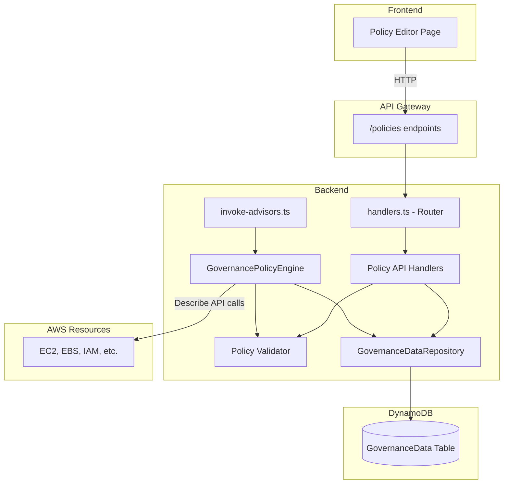

# Design Document: Custom Governance Policies

## Overview

Custom Governance Policies extends CloudGuardian with user-defined declarative compliance rules. Users create policies that specify conditions to check against AWS resource properties (e.g., "No EC2 instances larger than t3.medium"). These policies are evaluated during scans alongside existing advisors, and violations surface as standard Recommendation objects in the unified recommendations view.

The feature adds four components:
1. A **Policy Validator** in the shared package for structural validation of policy definitions
2. A **Policy CRUD API** in the backend for managing policies via REST endpoints
3. A **Policy Engine** advisor that evaluates enabled policies during scans
4. A **Policy Editor** page in the frontend for visual policy management

The design reuses existing patterns: the single-table DynamoDB design with PK/SK, the advisor output interface, the API handler routing, and the repository pattern.

## Architecture



### Integration Points

- **Scan Orchestrator**: The `invoke-advisors.ts` handler gains a new block that instantiates `GovernancePolicyEngine` and runs it alongside existing advisors. It follows the same try/catch/aggregate pattern.
- **API Router**: `handlers.ts` gains routes for `POST /policies`, `GET /policies`, `GET /policies/{policyId}`, `PUT /policies/{policyId}`, `DELETE /policies/{policyId}`.
- **DynamoDB**: Policies are stored in the existing `GovernanceData` table using `PK=POLICY#<policyId>`, `SK=POLICY`.
- **AdvisorType**: The shared `AdvisorType` union is extended with `"GovernancePolicyEngine"`.
- **Frontend Navigation**: A new "Policies" nav item is added to `navItems` in `App.tsx`.

## Components and Interfaces

### 1. Policy Validator (`packages/shared/src/policy-validation.ts`)

A pure validation module following the same `ValidationResult` pattern as `validation.ts`.

```typescript
import { ValidationResult } from "./validation";

// Valid condition operators
const VALID_OPERATORS = [
  "equals", "not_equals", "greater_than", "less_than",
  "in", "not_in", "contains", "not_contains", "exists", "not_exists"
] as const;

export type ConditionOperator = typeof VALID_OPERATORS[number];

export function validatePolicy(policy: Partial<GovernancePolicy>): ValidationResult;
```

Validation rules (all errors collected, not short-circuited):
- `name` must be a non-empty string
- `resourceType` must be a valid `ResourceType`
- `condition.operator` must be in `VALID_OPERATORS`
- `condition.property` must be a non-empty string
- `greater_than`/`less_than` require numeric `condition.value`
- `in`/`not_in` require array `condition.value`

### 2. Policy API Handlers (`packages/backend/src/api/policy-handlers.ts`)

Dedicated handler module for policy CRUD, imported by the main router.

```typescript
export async function handleCreatePolicy(event: APIGatewayProxyEvent): Promise<APIGatewayProxyResult>;
export async function handleListPolicies(): Promise<APIGatewayProxyResult>;
export async function handleGetPolicy(policyId: string): Promise<APIGatewayProxyResult>;
export async function handleUpdatePolicy(event: APIGatewayProxyEvent): Promise<APIGatewayProxyResult>;
export async function handleDeletePolicy(policyId: string): Promise<APIGatewayProxyResult>;
```

- `handleCreatePolicy`: Validates body via `validatePolicy`, generates UUID, defaults `enabled=true`, sets timestamps, persists via repository, returns 201.
- `handleUpdatePolicy`: Validates body, updates `updatedAt`, persists, returns 200.
- `handleGetPolicy`: Returns 404 if not found.
- `handleDeletePolicy`: Deletes item, returns 200.

### 3. Repository Extensions (`packages/backend/src/repository.ts`)

New methods on `GovernanceDataRepository`:

```typescript
async putPolicy(policy: GovernancePolicy): Promise<void>;
async getPolicy(policyId: string): Promise<GovernancePolicy | undefined>;
async listPolicies(): Promise<GovernancePolicy[]>;
async deletePolicy(policyId: string): Promise<void>;
```

DynamoDB key scheme: `PK=POLICY#<policyId>`, `SK=POLICY`. List uses a `begins_with(PK, "POLICY#")` scan or a dedicated query pattern.

### 4. Governance Policy Engine (`packages/backend/src/advisors/governance-policy-engine.ts`)

Follows the same class pattern as `SafeCleanupAdvisor`:

```typescript
export interface PolicyEngineInput {
  accountId: string;
  region: string;
  crossAccountRoleArn?: string;
}

export interface PolicyEngineOutput {
  recommendations: Recommendation[];
  resourcesEvaluated: number;
  errors: ScanError[];
}

export class GovernancePolicyEngine {
  constructor(scanId: string);
  async evaluate(input: PolicyEngineInput): Promise<PolicyEngineOutput>;
}
```

Evaluation flow:
1. Load all enabled policies from DynamoDB
2. If none, return `{ recommendations: [], resourcesEvaluated: 0, errors: [] }`
3. Group policies by `resourceType`
4. For each resource type group, query AWS resources in the target account/region
5. For each resource, evaluate each policy's condition using `evaluateCondition()`
6. On violation, create a `Recommendation` with `advisorType: "GovernancePolicyEngine"`
7. Catch per-policy errors, log, continue, aggregate into errors array

### 5. Condition Evaluator (`packages/backend/src/advisors/condition-evaluator.ts`)

Pure function module for evaluating conditions against resource property values:

```typescript
export function evaluateCondition(
  propertyValue: unknown,
  operator: ConditionOperator,
  conditionValue: unknown
): boolean; // returns true if VIOLATION detected

export function extractPropertyValue(
  resource: Record<string, unknown>,
  propertyPath: string
): unknown; // handles "Tags.KeyName" dot notation
```

### 6. Resource Property Mapper (`packages/backend/src/advisors/resource-property-mapper.ts`)

Maps raw AWS SDK resource objects to the flat property maps defined in Requirement 6:

```typescript
export type PropertyMap = Record<string, unknown>;

export function mapEC2Properties(instance: Instance): PropertyMap;
export function mapEBSProperties(volume: Volume): PropertyMap;
export function mapSecurityGroupProperties(sg: SecurityGroup): PropertyMap;
export function mapIAMUserProperties(user: User, metadata: IAMUserMetadata): PropertyMap;
export function mapIAMRoleProperties(role: Role): PropertyMap;
export function mapLambdaProperties(fn: FunctionConfiguration): PropertyMap;
export function mapRDSProperties(instance: DBInstance): PropertyMap;
export function mapLoadBalancerProperties(lb: LoadBalancer): PropertyMap;
```

### 7. Frontend Policy Editor (`packages/frontend/src/pages/PoliciesPage.tsx`)

React page component with:
- Policy list table (name, resource type, severity, enabled toggle)
- Create/Edit form modal with dynamic property dropdown based on selected resource type
- Delete confirmation dialog
- Inline validation error display

### 8. Frontend API Client Extensions (`packages/frontend/src/api-client.ts`)

```typescript
export function getPolicies(): Promise<GovernancePolicy[]>;
export function getPolicy(policyId: string): Promise<GovernancePolicy>;
export function createPolicy(policy: Omit<GovernancePolicy, 'policyId' | 'createdAt' | 'updatedAt'>): Promise<GovernancePolicy>;
export function updatePolicy(policyId: string, policy: Partial<GovernancePolicy>): Promise<GovernancePolicy>;
export function deletePolicy(policyId: string): Promise<{ success: boolean }>;
```

## Data Models

### GovernancePolicy

Added to `packages/shared/src/types.ts`:

```typescript
export type ConditionOperator =
  | "equals" | "not_equals"
  | "greater_than" | "less_than"
  | "in" | "not_in"
  | "contains" | "not_contains"
  | "exists" | "not_exists";

export interface PolicyCondition {
  property: string;           // Resource property path, e.g. "InstanceType" or "Tags.Environment"
  operator: ConditionOperator;
  value?: unknown;            // Not required for "exists"/"not_exists"
}

export interface GovernancePolicy {
  policyId: string;           // UUID
  name: string;
  description: string;
  enabled: boolean;           // Defaults to true
  resourceType: ResourceType;
  condition: PolicyCondition;
  severity: RiskLevel;        // Reuses existing "Low" | "Medium" | "High"
  createdAt: string;          // ISO 8601
  updatedAt: string;          // ISO 8601
}
```

### AdvisorType Extension

```typescript
export type AdvisorType =
  | "SafeCleanupAdvisor"
  | "PermissionDriftDetector"
  | "ZombieResourceDetector"
  | "GovernancePolicyEngine";
```

### DynamoDB Item Schema

Policies use the existing single-table design:

| Attribute | Value |
|-----------|-------|
| PK | `POLICY#<policyId>` |
| SK | `POLICY` |
| policyId | UUID string |
| name | Policy name |
| description | Policy description |
| enabled | boolean |
| resourceType | ResourceType string |
| condition | Map (property, operator, value) |
| severity | RiskLevel string |
| createdAt | ISO 8601 string |
| updatedAt | ISO 8601 string |

### Resource Property Maps

Each resource type exposes a defined set of properties for condition evaluation:

| Resource Type | Properties |
|--------------|------------|
| EC2Instance | InstanceType, State, PublicIpAddress, Tags, VpcId, SubnetId, ImageId, LaunchTime |
| EBSVolume | VolumeType, Size, State, Encrypted, Iops |
| SecurityGroup | GroupName, VpcId, InboundRuleCount, OutboundRuleCount, Tags |
| IAMUser | UserName, MfaEnabled, AccessKeyAge, PasswordLastUsed, Tags |
| IAMRole | RoleName, LastUsedDate, AttachedPolicyCount, Tags |
| LambdaFunction | Runtime, MemorySize, Timeout, CodeSize, LastModified, Tags |
| RDSInstance | DBInstanceClass, Engine, MultiAZ, StorageEncrypted, PubliclyAccessible, Tags |
| LoadBalancer | Type, Scheme, State, Tags |


## Correctness Properties

*A property is a characteristic or behavior that should hold true across all valid executions of a system — essentially, a formal statement about what the system should do. Properties serve as the bridge between human-readable specifications and machine-verifiable correctness guarantees.*

### Property 1: Policy JSON round-trip

*For any* valid `GovernancePolicy` object, serializing it to JSON via `JSON.stringify` and then deserializing via `JSON.parse` should produce an object deeply equal to the original.

**Validates: Requirements 3.8**

### Property 2: Validator rejects invalid resource types and accepts valid ones

*For any* string value used as `resourceType`, the policy validator should reject the policy if and only if the value is not a member of the `ResourceType` union. When rejected, the error message should reference the invalid resource type.

**Validates: Requirements 1.4, 3.2**

### Property 3: Validator rejects invalid operators and accepts valid ones

*For any* string value used as `condition.operator`, the policy validator should reject the policy if and only if the value is not in the set of valid operators (`equals`, `not_equals`, `greater_than`, `less_than`, `in`, `not_in`, `contains`, `not_contains`, `exists`, `not_exists`). When rejected, the error message should reference the invalid operator.

**Validates: Requirements 1.5, 3.3**

### Property 4: Validator rejects policies with missing required fields

*For any* policy input where `name` is empty/missing or `condition.property` is empty/missing, the validator should return errors identifying each missing field. All errors should be collected in a single response.

**Validates: Requirements 3.1, 3.4, 3.7**

### Property 5: Validator enforces operator-value type constraints

*For any* policy with `greater_than` or `less_than` operator and a non-numeric `condition.value`, the validator should reject it. *For any* policy with `in` or `not_in` operator and a non-array `condition.value`, the validator should reject it.

**Validates: Requirements 3.5, 3.6**

### Property 6: Equality operators are complementary

*For any* resource property value `v` and condition value `c`, `evaluateCondition(v, "equals", c)` returns true (violation) if and only if `v !== c`, and `evaluateCondition(v, "not_equals", c)` returns true if and only if `v === c`. The two operators should always return opposite results for the same inputs.

**Validates: Requirements 5.1, 5.2**

### Property 7: Numeric comparison operators are correct

*For any* two numbers `v` (property value) and `c` (condition value), `evaluateCondition(v, "greater_than", c)` returns true (violation) if and only if `v > c`, and `evaluateCondition(v, "less_than", c)` returns true if and only if `v < c`.

**Validates: Requirements 5.3, 5.4**

### Property 8: Set membership operators are complementary

*For any* value `v` and array `arr`, `evaluateCondition(v, "in", arr)` returns true (violation) if and only if `v` is not in `arr`, and `evaluateCondition(v, "not_in", arr)` returns true if and only if `v` is in `arr`. The two operators should always return opposite results.

**Validates: Requirements 5.5, 5.6**

### Property 9: Containment operators are complementary

*For any* string or array `v` and search value `c`, `evaluateCondition(v, "contains", c)` returns true (violation) if and only if `v` does not contain `c`, and `evaluateCondition(v, "not_contains", c)` returns true if and only if `v` does contain `c`. The two operators should always return opposite results.

**Validates: Requirements 5.7, 5.8**

### Property 10: Existence operators are complementary

*For any* value `v`, `evaluateCondition(v, "exists", undefined)` returns true (violation) if and only if `v` is `undefined` or `null`, and `evaluateCondition(v, "not_exists", undefined)` returns true if and only if `v` is defined and not `null`. The two operators should always return opposite results.

**Validates: Requirements 5.9, 5.10**

### Property 11: Resource property mappers produce expected keys

*For any* resource type and a valid AWS resource object of that type, the corresponding property mapper function should produce a `PropertyMap` containing exactly the keys specified in Requirement 6 for that resource type (e.g., EC2Instance maps must contain `InstanceType`, `State`, `PublicIpAddress`, `Tags`, `VpcId`, `SubnetId`, `ImageId`, `LaunchTime`).

**Validates: Requirements 6.1, 6.2, 6.3, 6.4, 6.5, 6.6, 6.7, 6.8**

### Property 12: Tag property extraction via dot notation

*For any* resource with a `Tags` map containing key `K` with value `V`, calling `extractPropertyValue(resource, "Tags.K")` should return `V`. *For any* resource where tag key `K` is absent, `extractPropertyValue(resource, "Tags.K")` should return `undefined`.

**Validates: Requirements 7.1, 7.2, 7.3**

### Property 13: Violation recommendations have correct structure invariants

*For any* policy violation produced by the `GovernancePolicyEngine`, the resulting `Recommendation` should satisfy all of: `advisorType === "GovernancePolicyEngine"`, `riskLevel` equals the policy's `severity`, `issueDescription` contains the policy `name`, `suggestedAction` is a non-empty string, `estimatedMonthlySavings === null`, `availableActions` is an empty array, and `dependencies` is an empty array.

**Validates: Requirements 4.3, 4.4, 4.5, 9.1, 9.3, 9.4, 9.5, 9.6**

### Property 14: Policy create-then-read round trip

*For any* valid policy input, creating it via the API and then reading it back by the returned `policyId` should produce a policy with all the same field values as the input (plus generated `policyId`, `createdAt`, `updatedAt`).

**Validates: Requirements 2.1, 2.4**

### Property 15: Invalid policy inputs produce 400 with errors

*For any* policy input that fails validation (invalid resourceType, missing name, bad operator, etc.), both POST and PUT API calls should return a 400 status code with a non-empty array of error messages.

**Validates: Requirements 2.2, 2.8**

### Property 16: Enabled flag defaults to true

*For any* policy input that omits the `enabled` field, the created policy should have `enabled === true`.

**Validates: Requirements 1.3**

### Property 17: Only enabled policies are evaluated

*For any* set of policies where some are enabled and some are disabled, the `GovernancePolicyEngine` should only evaluate enabled policies. Disabled policies should produce zero violations regardless of resource state.

**Validates: Requirements 4.1**

### Property 18: Policy engine fault isolation

*For any* set of N policies where one policy's evaluation throws an error, the engine should still produce results for the remaining N-1 policies and include the error in the output errors array.

**Validates: Requirements 4.7**

### Property 19: Property dropdown matches resource type property map

*For any* resource type selected in the Policy Editor form, the property dropdown options should contain exactly the properties defined in the resource property map for that type.

**Validates: Requirements 8.3**

## Error Handling

### Policy Validation Errors

- All validation errors are collected and returned in a single `ValidationResult` with `valid: false` and a populated `errors` array.
- The API returns HTTP 400 with `{ errors: string[] }` body.
- The frontend displays errors inline next to the relevant form fields.

### Policy Engine Evaluation Errors

- **Per-policy failure**: If evaluating a single policy throws (e.g., AWS API permission denied for a resource type), the error is caught, logged, and added to the `errors` array. Remaining policies continue evaluation.
- **DynamoDB load failure**: If loading policies from DynamoDB fails, the engine records a `ScanError` and returns `{ recommendations: [], resourcesEvaluated: 0, errors: [scanError] }`. The scan continues with other advisors.
- **Missing resource property**: When a condition references a property not present on a resource, the property value is treated as `undefined`. The condition evaluator handles `undefined` gracefully per operator semantics (e.g., `exists` flags it, `equals` compares against `undefined`).
- **AWS API errors**: When the engine cannot describe resources in a region (e.g., service not available, access denied), it records a `ScanError` with `accountId`, `region`, `resourceType`, `errorCode`, and `errorMessage`.

### API Error Handling

- **404 Not Found**: `GET /policies/{policyId}` and `DELETE /policies/{policyId}` return 404 if the policy doesn't exist.
- **500 Internal Server Error**: Unhandled exceptions in handlers are caught by the main router's try/catch and return 500 with the error message.

## Testing Strategy

### Property-Based Testing

Use `fast-check` as the property-based testing library for TypeScript. Each property test runs a minimum of 100 iterations.

Property tests target the pure logic components:
- **Policy Validator** (`packages/shared/src/policy-validation.test.ts`): Properties 1-5 (round-trip, resourceType validation, operator validation, required fields, type constraints)
- **Condition Evaluator** (`packages/backend/src/advisors/condition-evaluator.test.ts`): Properties 6-10 (all operator pairs)
- **Resource Property Mappers** (`packages/backend/src/advisors/resource-property-mapper.test.ts`): Property 11 (expected keys)
- **Property Extraction** (`packages/backend/src/advisors/condition-evaluator.test.ts`): Property 12 (tag dot notation)
- **Recommendation Structure** (`packages/backend/src/advisors/governance-policy-engine.test.ts`): Property 13 (invariants)

Each property test must include a comment tag:
```
// Feature: custom-governance-policies, Property {N}: {title}
```

### Unit Testing

Unit tests complement property tests for specific examples, edge cases, and integration points:

- **Policy API handlers**: Test CRUD operations with specific valid/invalid payloads, 404 for missing policies, create-then-read-then-delete lifecycle (Properties 14-16)
- **Policy Engine integration**: Test with mocked AWS SDK clients and DynamoDB, verify enabled-only evaluation (Property 17), fault isolation (Property 18), empty policy set edge case
- **Frontend Policy Editor**: Test property dropdown updates on resource type selection (Property 19), form submission, toggle behavior, delete confirmation
- **Error scenarios**: DynamoDB load failure, AWS API permission denied, missing resource properties

### Test File Locations

| Test File | Covers |
|-----------|--------|
| `packages/shared/src/policy-validation.test.ts` | Policy validator (Properties 1-5) |
| `packages/backend/src/advisors/condition-evaluator.test.ts` | Condition evaluation + property extraction (Properties 6-10, 12) |
| `packages/backend/src/advisors/resource-property-mapper.test.ts` | Resource property mappers (Property 11) |
| `packages/backend/src/advisors/governance-policy-engine.test.ts` | Policy engine integration (Properties 13, 17, 18) |
| `packages/backend/src/api/policy-handlers.test.ts` | API CRUD handlers (Properties 14-16) |
| `packages/frontend/src/pages/PoliciesPage.test.tsx` | Policy Editor UI (Property 19) |
