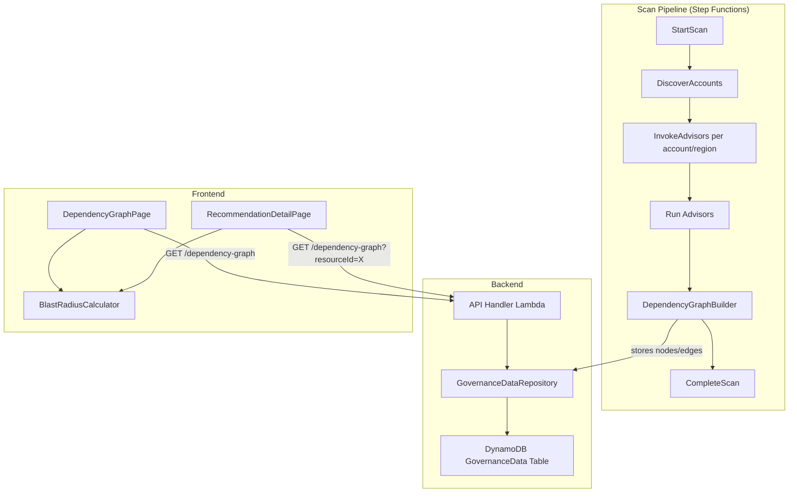

# Design Document: Resource Dependency Graph

## Overview

The Resource Dependency Graph feature adds dependency discovery, persistence, and visualization to CloudGuardian. During each scan, a new `DependencyGraphBuilder` module queries AWS APIs to discover relationships between resources (EC2 → Security Group → VPC, Lambda → IAM Role, etc.), stores them as nodes and edges in the existing DynamoDB table, and exposes them via new API endpoints. The frontend renders an interactive force-directed graph using React Flow, supports blast radius calculation via BFS traversal, and integrates dependency context into the existing Recommendation Detail Page.

### Key Design Decisions

1. **Single DynamoDB table**: Reuse the existing `GovernanceData` table with new PK/SK patterns (`GRAPH#<scanId>` / `NODE#<resourceId>` and `EDGE#<sourceId>#<targetId>`) rather than creating a separate table. This keeps infrastructure simple and leverages existing IAM permissions.

2. **React Flow for visualization**: React Flow is a mature, well-maintained React library for node-based graphs with built-in pan/zoom, selection, and layout support. It avoids heavy dependencies like D3 while providing the interactivity requirements need.

3. **Client-side blast radius**: The blast radius BFS traversal runs in the browser on the already-fetched graph data. Graph sizes per account/region are bounded (typically hundreds of nodes), making server-side computation unnecessary.

4. **Dependency discovery as a post-advisor step**: The `DependencyGraphBuilder` runs after advisors complete in the `invoke-advisors` orchestrator, reusing the same AWS credentials and region context. This avoids a separate Lambda and keeps the scan pipeline simple.

## Architecture



### Integration Points

- **invoke-advisors.ts**: After all advisors run, calls `DependencyGraphBuilder.discover()` to build the graph for the current account/region/scan.
- **handlers.ts**: New route handlers for `GET /dependency-graph` with optional query parameters.
- **api-client.ts**: New `getDependencyGraph()` and `getDependencySubgraph()` functions.
- **App.tsx**: New route `/dependency-graph` and nav item for the `DependencyGraphPage`.
- **RecommendationDetailPage.tsx**: Embedded mini-graph and blast radius summary panel.

## Components and Interfaces

### Backend Components

#### DependencyGraphBuilder

Location: `packages/backend/src/dependency-graph/builder.ts`

Responsible for discovering resource relationships using AWS SDK clients. Runs within the existing `invoke-advisors` Lambda.

```typescript
interface DiscoverInput {
  scanId: string;
  accountId: string;
  region: string;
  crossAccountRoleArn?: string;
}

interface DiscoverOutput {
  nodes: ResourceNode[];
  edges: DependencyEdge[];
  errors: GraphDiscoveryError[];
}

class DependencyGraphBuilder {
  async discover(input: DiscoverInput): Promise<DiscoverOutput>;

  // Internal discovery methods per resource type
  private async discoverEC2Dependencies(ec2Client: EC2Client): Promise<void>;
  private async discoverLambdaDependencies(lambdaClient: LambdaClient): Promise<void>;
  private async discoverECSDependencies(ecsClient: ECSClient): Promise<void>;
  private async discoverRDSDependencies(rdsClient: RDSClient): Promise<void>;
  private async discoverLoadBalancerDependencies(elbClient: ELBv2Client): Promise<void>;
}
```

#### Repository Extensions

Location: `packages/backend/src/repository.ts` (extend existing class)

```typescript
// New methods on GovernanceDataRepository
async putGraphNodes(scanId: string, nodes: ResourceNode[]): Promise<void>;
async putGraphEdges(scanId: string, edges: DependencyEdge[]): Promise<void>;
async getGraph(scanId: string): Promise<{ nodes: ResourceNode[]; edges: DependencyEdge[] }>;
async getSubgraph(scanId: string, resourceId: string, depth: number): Promise<{ nodes: ResourceNode[]; edges: DependencyEdge[] }>;
async deleteGraph(scanId: string): Promise<void>;
```

#### API Handler Extensions

Location: `packages/backend/src/api/handlers.ts` (extend existing handler)

```typescript
// New route: GET /dependency-graph
// Query params: ?resourceId=xxx&resourceType=EC2Instance
async function handleGetDependencyGraph(event: APIGatewayProxyEvent): Promise<APIGatewayProxyResult>;
```

### Frontend Components

#### DependencyGraphPage

Location: `packages/frontend/src/pages/DependencyGraphPage.tsx`

Main page component that fetches graph data and renders the interactive visualization.

#### BlastRadiusCalculator

Location: `packages/frontend/src/utils/blast-radius.ts`

Pure function module for computing blast radius via BFS on the graph adjacency structure.

```typescript
interface BlastRadiusResult {
  affectedNodes: ResourceNode[];
  affectedByType: Record<string, number>;
  totalAffected: number;
}

function calculateBlastRadius(
  graph: { nodes: ResourceNode[]; edges: DependencyEdge[] },
  selectedResourceId: string
): BlastRadiusResult;
```

#### MiniDependencyGraph

Location: `packages/frontend/src/components/MiniDependencyGraph.tsx`

Compact graph component embedded in the Recommendation Detail Page showing a single resource and its direct dependencies.

### Shared Types

Location: `packages/shared/src/types.ts` (extend existing file)

```typescript
interface ResourceNode {
  resourceId: string;
  resourceType: ResourceType | string; // Extend ResourceType for VPC, Subnet, etc.
  accountId: string;
  region: string;
  displayName: string;
}

interface DependencyEdge {
  sourceResourceId: string;
  targetResourceId: string;
  relationshipLabel: string; // e.g., "attached to", "member of", "launched in"
}

interface DependencyGraph {
  scanId: string;
  nodes: ResourceNode[];
  edges: DependencyEdge[];
}

interface GraphDiscoveryError {
  resourceType: string;
  errorCode: string;
  errorMessage: string;
}
```


## Data Models

### DynamoDB Schema (GovernanceData Table)

Reuses the existing single-table design with new PK/SK patterns.

#### Resource Nodes

| Attribute | Value | Description |
|-----------|-------|-------------|
| PK | `GRAPH#<scanId>` | Partition key scoped to scan |
| SK | `NODE#<resourceId>` | Sort key for individual node |
| resourceId | `string` | AWS resource ID (e.g., `i-0abc123`, `sg-456def`) |
| resourceType | `string` | Resource type (e.g., `EC2Instance`, `SecurityGroup`, `VPC`) |
| accountId | `string` | AWS account ID |
| region | `string` | AWS region |
| displayName | `string` | Human-readable name (Name tag or resource ID) |

#### Dependency Edges

| Attribute | Value | Description |
|-----------|-------|-------------|
| PK | `GRAPH#<scanId>` | Partition key scoped to scan |
| SK | `EDGE#<sourceResourceId>#<targetResourceId>` | Sort key for edge uniqueness |
| sourceResourceId | `string` | Source resource ID |
| targetResourceId | `string` | Target resource ID |
| relationshipLabel | `string` | Human-readable label (e.g., "attached to", "launched in") |

#### Scan-to-Graph Mapping

| Attribute | Value | Description |
|-----------|-------|-------------|
| PK | `GRAPHMETA#<accountId>#<region>` | Partition key for latest graph lookup |
| SK | `LATEST` | Constant sort key |
| scanId | `string` | Most recent scan ID with graph data |

This mapping enables the API to quickly find the latest graph for an account/region without scanning all graph partitions. When a new scan completes, this record is overwritten (satisfying Requirement 3.4).

### Relationship Labels

| Source Type | Target Type | Label |
|-------------|-------------|-------|
| EC2Instance | SecurityGroup | "uses security group" |
| EC2Instance | Subnet | "launched in" |
| EC2Instance | EBSVolume | "attached to" |
| EC2Instance | ElasticIP | "associated with" |
| EC2Instance | IAMRole | "uses instance profile" |
| SecurityGroup | VPC | "member of" |
| Subnet | VPC | "member of" |
| Lambda | IAMRole | "executes as" |
| Lambda | Subnet | "connected to" |
| Lambda | SecurityGroup | "uses security group" |
| ECSService | ECSCluster | "runs in" |
| ECSService | IAMRole | "uses task role" |
| ECSService | LoadBalancer | "registered with" |
| RDSInstance | SecurityGroup | "uses security group" |
| RDSInstance | SubnetGroup | "deployed in" |
| RDSInstance | IAMRole | "uses role" |
| LoadBalancer | SecurityGroup | "uses security group" |
| LoadBalancer | Subnet | "deployed in" |
| LoadBalancer | TargetGroup | "routes to" |

### Extended ResourceType

The existing `ResourceType` union in `types.ts` needs additional values for graph-only resource types:

```typescript
export type GraphResourceType =
  | ResourceType        // existing types
  | "VPC"
  | "Subnet"
  | "SubnetGroup"
  | "TargetGroup"
  | "ECSCluster"
  | "ElasticIP";
```

### API Response Shapes

#### GET /dependency-graph

```typescript
// Response
interface DependencyGraphResponse {
  scanId: string;
  nodes: ResourceNode[];
  edges: DependencyEdge[];
}
```

#### GET /dependency-graph?resourceId=xxx

Returns the subgraph within 2 edges of the specified resource (BFS from the resource, depth 2).

#### GET /dependency-graph?resourceType=EC2Instance

Returns only nodes matching the type and edges where at least one endpoint matches.


## Correctness Properties

*A property is a characteristic or behavior that should hold true across all valid executions of a system — essentially, a formal statement about what the system should do. Properties serve as the bridge between human-readable specifications and machine-verifiable correctness guarantees.*

### Property 1: Discovery completeness

*For any* set of AWS resources with known associations (EC2 instances with security groups, subnets, volumes, EIPs, instance profiles; Lambda functions with IAM roles, VPC configs; ECS services with clusters, task roles, load balancers; RDS instances with subnet groups, security groups, roles; Load Balancers with target groups, security groups, subnets), running the DependencyGraphBuilder should produce a DependencyEdge for every known association.

**Validates: Requirements 1.1, 1.2, 1.3, 2.1, 2.2, 2.3, 2.4**

### Property 2: Edge label invariant

*For any* DependencyEdge produced by the DependencyGraphBuilder, the `relationshipLabel` field must be a non-empty string.

**Validates: Requirements 1.4**

### Property 3: Graph persistence round-trip

*For any* valid DependencyGraph (set of ResourceNodes and DependencyEdges), storing the graph via `putGraphNodes` and `putGraphEdges` and then retrieving it via `getGraph` with the same scanId should produce an equivalent set of nodes and edges.

**Validates: Requirements 3.1, 3.2, 3.3, 4.1**

### Property 4: Graph replacement on new scan

*For any* account/region pair, if a graph is stored for scan A and then a new graph is stored for scan B for the same account/region, querying the latest graph should return only the nodes and edges from scan B, with zero nodes or edges from scan A.

**Validates: Requirements 3.4**

### Property 5: Subgraph BFS correctness

*For any* dependency graph and any resource node within it, the subgraph returned for that resource with depth N should contain exactly the set of nodes reachable within N edge traversals from the selected node, plus all edges between those nodes.

**Validates: Requirements 4.2**

### Property 6: Type filter correctness

*For any* dependency graph and any resource type filter value, all returned nodes must have a `resourceType` matching the filter, and all returned edges must have at least one endpoint (source or target) that matches the filter.

**Validates: Requirements 4.3, 5.6**

### Property 7: Blast radius transitivity

*For any* dependency graph and any selected resource node, the blast radius result should contain exactly the set of nodes reachable by following outgoing dependency edges transitively (BFS/DFS from the selected node), excluding the selected node itself. A node with no outgoing edges should produce an empty blast radius.

**Validates: Requirements 6.1, 5.4, 6.4**

### Property 8: Blast radius grouping consistency

*For any* blast radius result, the sum of all per-type counts in `affectedByType` must equal `totalAffected`, and each per-type count must equal the actual number of nodes of that type in the `affectedNodes` array.

**Validates: Requirements 6.3**

### Property 9: Distinct resource type styles

*For any* two distinct `GraphResourceType` values, the style mapping function must return different color values, ensuring visual distinguishability in the graph.

**Validates: Requirements 5.3**

### Property 10: Recommendation dependencies populated

*For any* recommendation whose resource has dependency edges in the graph, the `dependencies` field on the Recommendation object should contain a DependencyInfo entry for each edge connected to that resource.

**Validates: Requirements 7.4**

## Error Handling

### Discovery Errors

- Each resource type discovery method (`discoverEC2Dependencies`, `discoverLambdaDependencies`, etc.) is wrapped in a try/catch within `DependencyGraphBuilder.discover()`.
- If one resource type fails (e.g., Lambda API throttling), the builder continues with remaining types and collects errors in `GraphDiscoveryError[]`.
- Successfully discovered nodes and edges are persisted regardless of partial failures (Requirement 3.5).
- Errors are logged and included in the scan's `errors` array.

### API Errors

- `GET /dependency-graph` with no data returns `200` with `{ scanId: "", nodes: [], edges: [] }` (Requirement 4.4).
- Invalid `resourceId` parameter returns `200` with empty graph (resource not found is not an error).
- Invalid `resourceType` parameter returns `400` with descriptive error message.

### Frontend Errors

- Graph fetch failures display an error banner with retry button.
- If React Flow fails to render (e.g., too many nodes), display a fallback table view of nodes and edges.
- Blast radius calculation on disconnected/empty graphs returns `{ affectedNodes: [], affectedByType: {}, totalAffected: 0 }`.

## Testing Strategy

### Property-Based Testing

The project already uses `fast-check` (v3.23.0) in both `packages/backend` and `packages/frontend`. All property-based tests should use `fast-check` with a minimum of 100 iterations per property.

Each property test must be tagged with a comment referencing the design property:
```
// Feature: resource-dependency-graph, Property N: <property title>
```

Each correctness property (1-10) must be implemented as a single property-based test.

#### Backend Property Tests

| Property | Test File | What It Generates |
|----------|-----------|-------------------|
| Property 1: Discovery completeness | `builder.property.test.ts` | Random AWS resource configurations with known associations; verifies all expected edges are produced |
| Property 2: Edge label invariant | `builder.property.test.ts` | Random discovery outputs; verifies all edges have non-empty labels |
| Property 3: Graph persistence round-trip | `repository.property.test.ts` | Random ResourceNode[] and DependencyEdge[] arrays; stores and retrieves, checks equality |
| Property 4: Graph replacement | `repository.property.test.ts` | Two random graphs for same account/region; verifies only second is returned |
| Property 5: Subgraph BFS correctness | `subgraph.property.test.ts` | Random graphs and random node selections; verifies BFS depth boundary |
| Property 6: Type filter correctness | `handlers.property.test.ts` | Random graphs and random type filters; verifies all results match filter |
| Property 10: Recommendation dependencies | `builder.property.test.ts` | Random recommendations and graph edges; verifies dependencies field populated |

#### Frontend Property Tests

| Property | Test File | What It Generates |
|----------|-----------|-------------------|
| Property 7: Blast radius transitivity | `blast-radius.property.test.ts` | Random directed graphs and random start nodes; verifies BFS result matches expected reachable set |
| Property 8: Blast radius grouping | `blast-radius.property.test.ts` | Random blast radius results; verifies count consistency |
| Property 9: Distinct resource type styles | `graph-styles.property.test.ts` | All pairs of distinct resource types; verifies unique colors |

### Unit Tests

Unit tests complement property tests for specific examples and edge cases:

- **Edge cases**: Empty graphs, single-node graphs, disconnected components, cycles in dependency graph
- **API integration**: Mock DynamoDB responses for handler tests
- **Discovery mocking**: Mock AWS SDK responses for specific resource configurations
- **UI components**: React Testing Library tests for DependencyGraphPage rendering, filter panel interactions, blast radius panel display
- **Error scenarios**: Partial discovery failures, API timeouts, malformed responses

