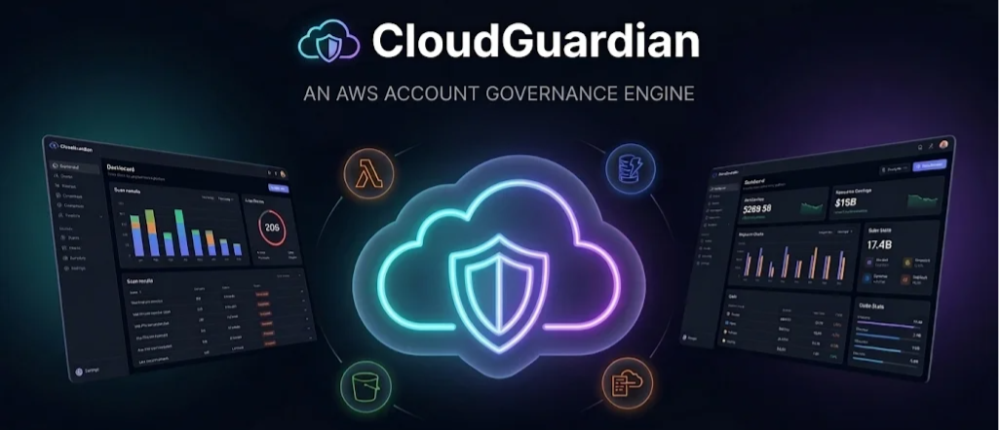

<p align="center">
  
</p>

<h1 align="center">CloudGuardian</h1>
<p align="center"><strong>Keep Your Cloud Clean</strong></p>
<p align="center">
  An intelligent AWS governance engine that continuously scans your cloud infrastructure, detects waste, security risks, and forgotten resources — then helps you fix them.
</p>

---

## What is CloudGuardian?

CloudGuardian is a full-stack serverless application that acts as your AWS account's governance layer. It scans 35+ AWS service types across single accounts or entire AWS Organizations, identifies idle resources, permission drift, zombie infrastructure, and policy violations — then provides actionable recommendations with one-click remediation.

### Four Core Advisors

| Advisor | What It Does |
|---------|-------------|
| 🧹 **Safe Cleanup Advisor** | Detects idle resources like unused EBS volumes, stopped EC2 instances, orphaned Elastic IPs, and unused load balancers. Checks dependencies before recommending cleanup. |
| 🔐 **Permission Drift Detector** | Analyzes IAM users, roles, and policies using CloudTrail activity to find unused permissions, wildcard policies, inactive roles, and risky access configurations. |
| 🧟 **Zombie Resource Detector** | Finds forgotten resources such as detached EBS volumes, unused security groups, inactive Lambda functions, and unattached network interfaces still generating costs. |
| 📋 **Custom Governance Policy Engine** | Enables teams to define custom governance rules visually without code, using 10 condition operators to evaluate resource properties. Policies run automatically during every scan. |

### Key Features

- **35+ AWS Services Scanned** — EC2, EBS, S3, IAM, Lambda, RDS, ECS, DynamoDB, CloudFront, API Gateway, Route 53, EFS, ElastiCache, Kinesis, Cognito, KMS, WAF, CodePipeline, and more
- **Resource Dependency Graph** — Interactive visualization of how your AWS resources are connected, with blast radius analysis before taking action
- **Real-Time Billing Dashboard** — Live cost data from AWS Cost Explorer with spending trends, service breakdown, forecasts, and AI-powered cost insights via Amazon Bedrock
- **One-Click Remediation** — Take action directly from the dashboard (terminate, stop, delete, release, detach)
- **AI-Powered Analysis** — Get detailed remediation plans for any finding using Amazon Bedrock (Nova Lite)
- **Custom Governance Policies** — Visual policy builder with 10 condition operators (equals, contains, exists, greater_than, etc.)
- **Automated Scanning** — EventBridge-triggered scans every 6 hours via Step Functions orchestration
- **Multi-Account Support** — Scan across AWS Organizations with cross-account role assumption
- **Email Digest Reports** — Weekly AI-generated email summaries via SES
- **Dark/Light Theme** — Full theme support across the dashboard

---


### AWS Services Used

| Layer | Services |
|-------|----------|
| **Frontend** | S3 (static hosting), CloudFront (CDN) |
| **API** | API Gateway (REST), Lambda (Node.js 22) |
| **Data** | DynamoDB (single-table design) |
| **Orchestration** | Step Functions (scan workflow), EventBridge (scheduling) |
| **AI** | Amazon Bedrock (Nova Lite — cost insights, AI analysis, email digests) |
| **Billing** | AWS Cost Explorer API |
| **Email** | Amazon SES (weekly digest reports) |
| **Scanned** | EC2, EBS, S3, IAM, Lambda, RDS, ECS, ELB, CloudWatch, VPC, SNS, SQS, DynamoDB, CloudFront, Route 53, EFS, ECR, ElastiCache, EventBridge, Kinesis, Cognito, Secrets Manager, ACM, KMS, WAF, CodePipeline, CodeBuild, CodeCommit, Amplify, API Gateway, CloudFormation, Auto Scaling, Step Functions, Glue, Athena, SageMaker |

### Scan Flow

```
EventBridge (every 6 hours)
    → Step Functions State Machine
        → StartScan (create scan record)
        → DiscoverAccounts 
        → Map over account × region combinations
            → InvokeAdvisors (all 4 advisors in parallel)
        → CompleteScan (aggregate results)
        → [On error] FailScan
```

---

## Prerequisites

- **Node.js** 18+ (recommended: 22) — [Download](https://nodejs.org/)
- **npm** 9+ (comes with Node.js)
- **AWS CLI v2** — [Install Guide](https://docs.aws.amazon.com/cli/latest/userguide/getting-started-install.html)
- **AWS CDK v2** — Install globally: `npm install -g aws-cdk`
- **An AWS Account** with admin-level IAM access

### Setting Up AWS Credentials

CloudGuardian deploys to your AWS account using the AWS CLI. You need to configure credentials before deploying.

## Quick Start

### 1. Clone the Repository

```bash
git clone https://github.com/DeepikaSidda/CloudGuardian.git
cd CloudGuardian
```

### 2. Install Dependencies

```bash
npm install
```

This installs dependencies for all four packages (shared, backend, frontend, infra) via npm workspaces.

### 3. Build All Packages

```bash
# Build shared types first (other packages depend on it)
npm run build:shared

# Build backend
npm run build:backend

# Build infrastructure
npm run build:infra

# Build frontend
npm run build:frontend
```

Or build everything at once:

```bash
npm run build
```

### 4. Bootstrap CDK (First Time Only)

If you've never used CDK in your AWS account/region:

```bash
npx cdk bootstrap
```

### 5. Deploy to AWS

```bash
npx cdk deploy --require-approval never
```

This creates:
- DynamoDB table (`GovernanceData`)
- 6 Lambda functions (API handler, scan orchestration steps)
- API Gateway REST API
- Step Functions state machine
- EventBridge rules (auto-scan every 6 hours, weekly report)
- S3 bucket for the frontend
- CloudFront distribution
- Required IAM roles

After deployment, CDK outputs the CloudFront URL and API Gateway endpoint. Note these values.

### 6. Configure the Frontend API Endpoint

The frontend needs to know your API Gateway URL. Update the API base URL in `packages/frontend/src/api-client.ts`:

```typescript
const API_BASE = "https://YOUR_API_ID.execute-api.YOUR_REGION.amazonaws.com/prod";
```

Then rebuild and deploy the frontend:

```bash
# Build frontend
cd packages/frontend
npm run build

# Deploy to S3 (replace with your bucket name from CDK output)
aws s3 sync dist s3://YOUR_BUCKET_NAME --delete

# Invalidate CloudFront cache (replace with your distribution ID from CDK output)
aws cloudfront create-invalidation --distribution-id YOUR_DISTRIBUTION_ID --paths "/*"
```

### 7. Run Your First Scan

Open the CloudFront URL in your browser and click **🔍 Run Scan** on the dashboard. The scan takes 30-60 seconds depending on the number of resources in your account.

---

## Local Development

### Frontend Dev Server

```bash
npm run dev -w packages/frontend
```

This starts a Vite dev server at `http://localhost:5173`. You'll need to configure the API base URL to point to your deployed API Gateway endpoint.

### Running Tests

```bash
# Run all tests
npm test

# Run tests for a specific package
npm run test:shared
npm run test:backend
npm run test:frontend
```

### Building the Backend Bundle

The backend uses esbuild to create a single-file bundle for Lambda deployment:

```bash
cd packages/backend
node esbuild.mjs
```

This outputs to `packages/backend/dist-bundle/index.mjs`. The esbuild config marks `@aws-sdk/*` as external since they're available in the Lambda Node.js 22 runtime.

### Manual Lambda Deployment

If you need to update Lambda functions without a full CDK deploy:

```bash
# Build and bundle
cd packages/backend
npm run build

# Create zip
# PowerShell:
Compress-Archive -Path dist-bundle/* -DestinationPath dist-bundle.zip -Force

# Bash/Linux:
cd dist-bundle && zip -r ../dist-bundle.zip . && cd ..

# Update all Lambda functions
aws lambda update-function-code --function-name GovernanceEngine-ApiHandler --zip-file fileb://dist-bundle.zip
aws lambda update-function-code --function-name GovernanceEngine-DiscoverAccounts --zip-file fileb://dist-bundle.zip
aws lambda update-function-code --function-name GovernanceEngine-InvokeAdvisors --zip-file fileb://dist-bundle.zip
aws lambda update-function-code --function-name GovernanceEngine-StartScan --zip-file fileb://dist-bundle.zip
aws lambda update-function-code --function-name GovernanceEngine-CompleteScan --zip-file fileb://dist-bundle.zip
aws lambda update-function-code --function-name GovernanceEngine-FailScan --zip-file fileb://dist-bundle.zip
```

---

## Dashboard Pages

| Page | Description |
|------|-------------|
| 📊 **Dashboard** | Health score, stat cards, risk distribution donut chart, findings trend, billing overview with AI cost insights |
| 💡 **Recommendations** | All findings with filters by advisor, risk level, resource type. Click any finding for details + AI analysis |
| 🔌 **Active Services** | Live view of all AWS services currently active in your account |
| 🗺️ **Resource Map** | Visual map of all discovered resources grouped by service type |
| 🔗 **Dependencies** | Interactive dependency graph (ReactFlow) showing how resources are connected |
| 📋 **Policies** | Create and manage custom governance policies with a visual condition builder |
| 🚨 **Cost Anomalies** | Detect unusual spending patterns and cost spikes |
| 📈 **Trends** | Historical scan data, findings over time, scan history |
| ⚡ **Actions** | Track all remediation actions taken (pending, in-progress, completed, failed) |
| ⚙️ **Settings** | Configure scan schedule, dashboard refresh interval, sound notifications, theme, budget alerts, timezone |
| 🤖 **Assistant** | AI-powered chat assistant for cloud governance questions (powered by Amazon Bedrock) |

---


## Cost Estimates

CloudGuardian is designed to be cost-efficient. Approximate monthly costs for a typical single-account setup:

| Service | Estimated Cost |
|---------|---------------|
| Lambda (6 functions, ~120 invocations/day) | ~$0.00 (free tier) |
| DynamoDB (on-demand, ~1GB storage) | ~$0.25 |
| API Gateway (~10K requests/month) | ~$0.04 |
| Step Functions (~4 executions/day) | ~$0.10 |
| Cost Explorer API (~4 calls/day, cached) | ~$1.20 |
| S3 + CloudFront (static site) | ~$0.50 |
| Bedrock Nova Lite (AI features) | ~$0.50-2.00 |
| **Total** | **~$2-4/month** |

> Note: The per-recommendation "estimated monthly savings" values use approximate us-east-1 on-demand pricing. The billing dashboard uses real Cost Explorer data.

---


## Tech Stack

- **Language**: TypeScript (end-to-end)
- **Frontend**: React 18, React Router 6, ReactFlow, Vite
- **Backend**: AWS Lambda (Node.js 22), esbuild bundling
- **Infrastructure**: AWS CDK v2
- **Database**: DynamoDB (single-table design)
- **AI**: Amazon Bedrock (Nova Lite)
- **Testing**: Jest, fast-check (property-based testing)
- **Monorepo**: npm workspaces

---

Built with ❤️ for every AWS user tired of surprise bills and forgott
